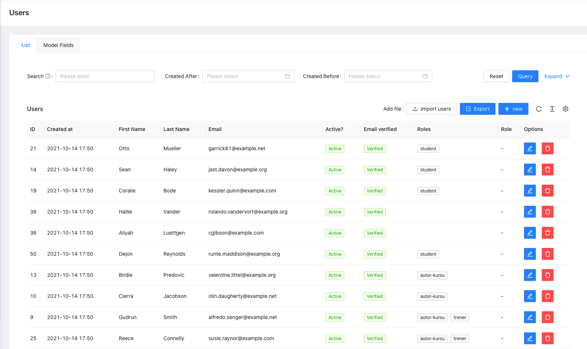
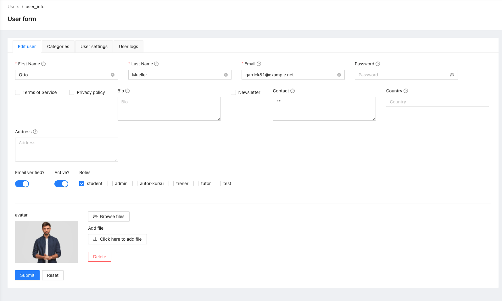
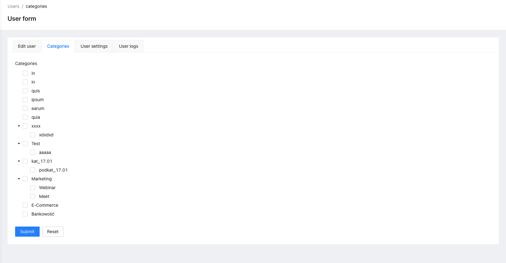
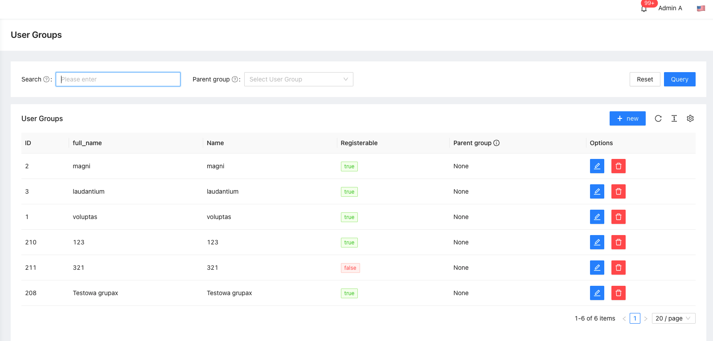
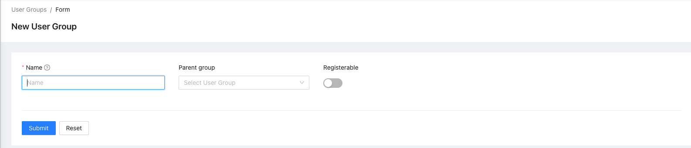
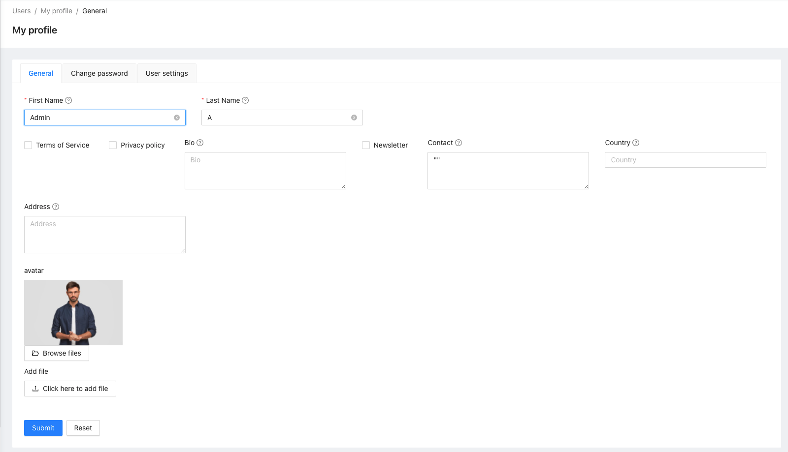

# Auth

[](https://escolalms.github.io/Auth/)
[](https://codecov.io/gh/EscolaLMS/Auth)
[](https://github.com/EscolaLMS/Core/actions/workflows/test.yml)
[](https://packagist.org/packages/escolalms/auth)
[](https://packagist.org/packages/escolalms/auth)
[](https://packagist.org/packages/escolalms/auth)
[](https://codeclimate.com/github/EscolaLMS/Auth/maintainability)

## What does it do

Package for user authentication. In addition, the package includes:
- user management,
- group management,
- profile management,
- registration.

## Installing

- `composer require escolalms/auth`
- `php artisan migrate`
- `php artisan db:seed --class="EscolaLms\Auth\Database\Seeders\AuthPermissionSeeder"`

Optional: 
- Run command `escolalms:admin`. 

## Commands
- `escolalms:admin` - create account with role admin

## Database

1. `category_user` - Table is used to store the user categories.
2. `groups` - Table for storing groups.
3. `group_user` - Table for storing groups assigned to the user.

```
User 1 -> n Categories
User 1 -> n Groups
```

## Endpoints

All the endpoints are defined in [](https://escolalms.github.io/Auth/)

## Tests

Run `./vendor/bin/phpunit` to run tests.
[](https://github.com/EscolaLMS/Core/actions/workflows/test.yml)
[](https://codecov.io/gh/EscolaLMS/Auth)

## Events

- `AccountBlocked` - Event is dispatched after blocking the user's account (`is_active=false`).
- `AccountConfirmed` - Event is dispatched after the user verifies the account.
- `AccountDeleted` - Event is dispatched after deleting the user.
- `AccountMustBeEnableByAdmin` - Event is dispatched when the user registers and `Config::get('escola_auth.account_must_be_enabled_by_admin') === SettingStatusEnum::ENABLED`
- `AccountRegistered` - Event is dispatched after the account is registered.
- `ForgotPassword` - Event is dispatched when a password reset request is sent.
- `Login` - Event is dispatched on successful login.
- `Logout` - Event is dispatched after logout.
- `PasswordChanged` - Event is dispatched after the password changed.
- `ResetPassword` - Event is dispatched after resetting the password. 
- `UserAddedToGroup` - Event is dispatched after adding the user to the group.
- `UserRemovedFromGroup` - Event is dispatched after removing the user from the group.


## Listeners

- `CreatePasswordResetToken` - The listener listens for the ForgotPassword event and executes the following method. 
```php
public function handle(ForgotPassword $event): void
{
    if (!is_callable(self::getRunEventForgotPassword()) || self::getRunEventForgotPassword()()) {
        $user = $event->getUser();

        $this->userRepository->update([
            'password_reset_token' => Str::random(32),
        ], $user->getKey());

        $user->refresh();

        $user->notify(new ResetPassword($user->password_reset_token, $event->getReturnUrl()));
    }
}
```

This is useful if you are using [TemplateEmail](https://github.com/EscolaLMS/Templates-Email) and you don't want to send the default e-mails.
```php
 CreatePasswordResetToken::setRunEventForgotPassword(
    function () {
        $templateRepository = app(TemplateRepositoryContract::class);
        return empty($templateRepository->findTemplateDefault(
            ForgotPassword::class,
            EmailChannel::class
        ));
    }
 );
```

- `SendEmailVerificationNotification` - The listener listens for the AccountRegistered event and executes the following method.  
```php
public function handle(Registered $event)
{
    if (!is_callable(self::getRunEventEmailVerification()) || self::getRunEventEmailVerification()()) {
        if ($event->user instanceof MustVerifyEmail && !$event->user->hasVerifiedEmail()) {
            $event->user->sendEmailVerificationNotification();
        }
    }
}
```

## How to use this on frontend

### Admin panel

**List of users**


**Creating/editing user**


**User categories**


**List of groups**


**Creating/editing group**


**My profile**


## Permissions

Permissions are defined in [seeder](database/seeders/AuthPermissionSeeder.php).
